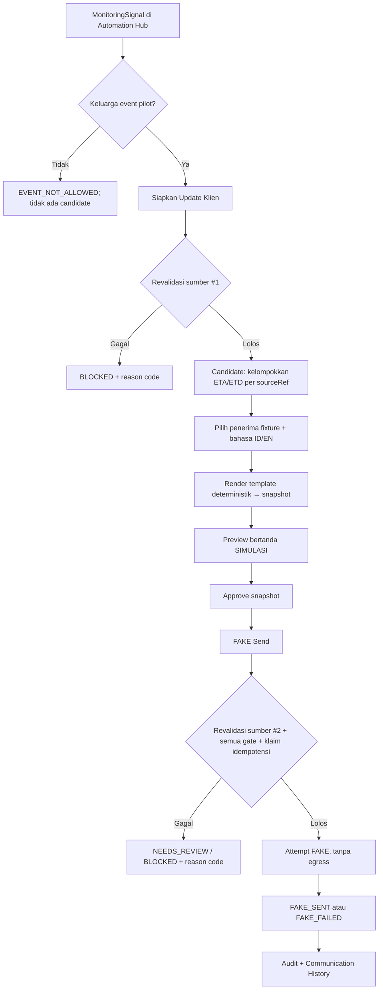

# PRD WA-1 — Update Klien WhatsApp: Proof-of-Flow FAKE & Acceptance Criteria

**Maritim Suite / Tribuana Automation Hub — PT Tribuana Solusi Maritim**

| Atribut | Nilai |
|---|---|
| Document ID | TSM-WA-1-PRD |
| Versi | **0.2 — BASELINE (owner approved)** |
| Tanggal | 5 Oktober 2026 (Asia/Makassar) |
| Owner produk | Owner Maritim Suite / PT Tribuana Solusi Maritim |
| Basis kode yang direkonsiliasi | `main` @ `dd1b3301398bed8b795e1435de1db8e0545a5acf` |
| Target alur | Signal → Communication Candidate → Prepare/Preview → Approve → FAKE Send → Delivery state FAKE → Audit |
| Status approval dokumen | **OWNER APPROVED** (5 Okt 2026), termasuk P-04 dan P-08. Persetujuan baseline **tidak** memberi otorisasi implementasi; implementasi WA-1 butuh izin owner terpisah |
| Checkpoint kanonik | `docs/TAH-CURRENT-CHECKPOINT.md` |

> **Status baseline:** v0.2 sudah direkonsiliasi terhadap kode `main` dan audit WA-0, dan **disetujui owner sebagai baseline** (5 Okt 2026). Penyusunan dokumen ini tidak membuat kode, migrasi, perubahan schema, konfigurasi provider, deployment, atau pengiriman WhatsApp.

**Aturan pembacaan:** **EXISTING** = terbukti ada di kode `main` @ `dd1b330`. **TO BUILD IN WA-1** = dibangun pada implementasi WA-1 setelah baseline disetujui. **DEFERRED (WA-2+)** = di luar WA-1. D-xx = keputusan owner. P-xx = usulan default yang perlu disahkan bersama dokumen. FR/SG/AC/TS = kontrak desain, bukan klaim fitur yang sudah ada.

---

## 1. Ringkasan keputusan

WA-1 membuktikan alur internal dari signal operasional yang sudah ada menjadi update klien yang disiapkan, ditinjau, disetujui, disimulasikan, dan tercatat, **tanpa egress WhatsApp apa pun**. Signal tidak pernah langsung menjadi pesan keluar, dan acknowledgement signal bukan approval pesan.

Empat keluarga event pilot: **perubahan ETA/ETD**, **EOSP**, **ALL_FAST**, **SAILED**. Pesan memakai template aplikasi deterministik berversi dalam Bahasa Indonesia (`ID`) atau Inggris (`EN`), tanpa LLM. Proof-of-flow memakai mode **`INTERNAL_FAKE_TEST`** dengan provider `FAKE` yang tidak membuka koneksi ke WhatsApp/provider mana pun. Kebijakan `EXTERNAL_COMMUNICATION` (tanpa self-approval) **tidak dilemahkan**. Jalur WhatsApp nyata pada fase berikutnya wajib resmi; provider belum dipilih.

Perubahan utama v0.2 dibanding v0.1 (rinci di §21):
- **K-1:** ETA/ETD adalah **tanggal kalender**; template jadwal memakai tanggal saja.
- **K-2:** satu perubahan ETA+ETD menghasilkan **dua** `MonitoringSignal` dengan `sourceRef` (id `AuditLog`) yang sama; lapisan komunikasi mengelompokkannya menjadi **satu** Communication Candidate. Monitoring tidak diubah.
- **K-3:** tidak ada field terminal/berth di schema; template ALL_FAST memakai pelabuhan saja. Schema tidak diubah.
- **K-4:** `INTERNAL_FAKE_TEST` diisolasi sebagai jenis approval non-produksi; tidak membuka self-approval untuk komunikasi eksternal.
- Gate revalidasi sumber sebelum Prepare **dan** sebelum Send; `VoyageEvent.deletedAt != null` → **MUST NOT SEND**.
- Timezone pelabuhan wajib untuk milestone; tanpa fallback diam-diam.
- Penomoran fase diselaraskan: implementasi proof-of-flow FAKE = **WA-1**; kontak/consent = **WA-2** (lihat §18).

## 2. Sumber dan rekonsiliasi

### 2.1 Register sumber

| ID | Sumber | Pemakaian |
|---|---|---|
| S-01 | Instruksi owner (5 Okt 2026), termasuk instruksi revisi v0.2 | Sumber keputusan scope dan koreksi wajib |
| S-02 | Laporan audit WA-0 (read-only architecture audit, sesi Claude Code 5 Okt 2026). Ini dokumen yang pada v0.1 dirujuk sebagai `Pasted markdown.md`; tidak disimpan sebagai file repo | Temuan arsitektur; dicocokkan ulang ke kode |
| S-03 | Kode `main` @ `dd1b330` | **Sumber primer** untuk setiap klaim EXISTING |
| S-04 | `docs/TAH-CURRENT-CHECKPOINT.md` | Keadaan produksi, keputusan owner, batas alur terverifikasi |

### 2.2 Rekonsiliasi temuan v0.1 terhadap kode

| ID | Temuan v0.1 | Hasil verifikasi pada S-03 | Status |
|---|---|---|---|
| A-01 | Rantai Voyage → Monitoring → Signal → Human Review ada | EXISTING; terverifikasi E2E di produksi oleh owner (5 Okt 2026, S-04 §D) | Terkonfirmasi |
| A-02 | Monitoring mendeteksi ETA/ETD dan milestone | EXISTING: `ETA_CHANGED` dari `AuditLog` peristiwa `UBAH_TANGGAL`; `OPERATIONAL_EVENT_RECORDED` dari `VoyageEvent` (`src/services/automation/monitoring-policy.ts`). Dengan koreksi K-1 dan K-2 | Terkonfirmasi + dikoreksi |
| A-03 | Primitive signal/notification/audit/dispatcher/webhook/adapter ada | EXISTING sebagai primitive: `MonitoringSignal`, `notify()`+`dedupeKey`, `catatAudit()`, `/api/jobs/run`, verifikasi signature konstan-waktu (`src/lib/billing/duitku.ts`), pola adapter `NONE`/`FAKE` (`src/services/ais/`) | Terkonfirmasi; reuse tetap harus dicek kontraknya |
| A-04 | `EXTERNAL_COMMUNICATION` + larangan self-approval ada; executor approval belum | EXISTING: `tah-policy.ts` (`KELAS_RISIKO`, `SETUJU_SENDIRI_BAWAAN.EXTERNAL_COMMUNICATION = false`, `bolehMemutuskan()` → `SELF_APPROVAL_FORBIDDEN`); `TahApprovalRequest` hanya schema + kebijakan murni, tanpa service/API/UI/executor | Terkonfirmasi |
| A-05 | Pemetaan signal → update klien belum ada | Belum ada | Terkonfirmasi |
| A-06 | Outbox, adapter WhatsApp, delivery status, idempotensi komunikasi, webhook WhatsApp belum ada | Belum ada; jejak WhatsApp di kode hanya tautan `wa.me` manual | Terkonfirmasi |
| A-07 | Template deterministik tanpa LLM, subset event | Konsisten; teks signal sendiri sudah deterministik | Terkonfirmasi |

### 2.3 Koreksi wajib v0.2

| ID | Temuan pada kode | Penyelesaian di v0.2 |
|---|---|---|
| **K-1** | ETA/ETD disimpan dan diaudit sebagai **kunci tanggal kalender `YYYY-MM-DD`** (keputusan D4 PRD-002; `kunciTanggalSah()`); tidak ada jam | Template jadwal hanya menampilkan tanggal (§11.2). Aturan "instant sama format berbeda" dihapus untuk ETA/ETD. ETA/ETD tidak memakai timezone |
| **K-2** | `updateVoyage` menulis **satu** baris `AuditLog` `UBAH_TANGGAL` berisi larik `medan`; monitoring membuat **satu signal per medan** dengan `dedupeKey = ETA_CHANGED:{voyageId}:{auditId}:{eta|etd}` dan `sourceRef = auditId` | Monitoring tidak diubah. Lapisan komunikasi mengelompokkan signal ETA/ETD dengan `sourceRef` sama menjadi satu Communication Candidate (§6.2) |
| **K-3** | Tidak ada field terminal/berth terstruktur di schema mana pun | `terminal_berth_name` dihapus dari template dan field wajib ALL_FAST. Tidak ada perubahan schema. Berth/terminal terstruktur = future scope |
| **K-4** | Registri TAH sudah punya pola jenis approval `TAH_DEV_NOOP` dengan `hanyaNonProduksi: true` + `setujuSendiri: true`; `jenisBolehDiLingkungan()` menolaknya bila `NODE_ENV === 'production'` | `INTERNAL_FAKE_TEST` memakai jenis approval terpisah yang **hanya non-produksi**, kelas risiko internal, executor terkunci ke `FAKE` (§12.2). Jenis untuk pesan klien nyata tetap `EXTERNAL_COMMUNICATION` tanpa self-approval dan **tidak diaktifkan** di WA-1 |

### 2.4 Temuan tambahan yang mempengaruhi gate

- `createVoyageEvent` **tidak** menolak `occurredAt` di masa depan, dan pembuatan maupun penghapusan `VoyageEvent` **tidak** ditulis ke `AuditLog`. Akibatnya WA-1 wajib memeriksa waktu dan status hapus langsung pada record sumber (SG-03, SG-04).
- Signal yang sudah dibuat **tidak** berubah ketika `VoyageEvent` sumbernya di-soft-delete. Signal lama tetap terlihat; hanya revalidasi sumber yang mencegah pengiriman.
- `Port.timezone` adalah teks bebas nullable (placeholder UI `Asia/Makassar`), tidak divalidasi sebagai zona IANA.
- `Voyage.dataOrigin` dicap otomatis berdasarkan `goLiveAt` tenant (`stempelAsal()`); nilainya **bukan** penanda data uji yang andal. Status `dataOrigin` voyage uji produksi `VYG-2026-000003` = **UNVERIFIED**.

## 3. Problem statement dan pengguna

Signal operasional sudah tersedia dan terverifikasi, tetapi belum ada alur yang mengubahnya menjadi update klien yang konsisten, ditinjau, disetujui, dan dapat ditelusuri. Tanpa alur ini, update berisiko salah konteks, berbeda redaksi, terkirim ganda, atau tidak dapat dibuktikan riwayatnya.

| Persona | Kebutuhan |
|---|---|
| Admin/operator (`ADMIN`, `MANAJER_OPERASI`) | Menyiapkan update dari signal sah tanpa mengetik ulang fakta |
| Reviewer internal | Melihat isi persis, sumber, waktu, bahasa, dan penerima sebelum menyetujui |
| Owner | Membuktikan alur kecil yang aman sebelum memutuskan WhatsApp nyata |
| Auditor berwenang | Menelusuri signal → candidate → snapshot → approval → attempt → hasil |

Klien nyata **bukan** penerima pada WA-1.

## 4. Goals dan ukuran keberhasilan proof-of-flow

| Metrik | Target penerimaan | Cara menilai |
|---|---|---|
| Kelengkapan alur | Semua happy path empat keluarga event (ID dan EN) mencapai `FAKE_SENT` | TS-01, TS-02, TS-03, TS-06, TS-07, TS-08 |
| Determinisme | Input kanonik + versi template identik → body identik byte-per-byte | Perbandingan expected body |
| Kesesuaian approval | Setiap `FAKE_SENT` memakai snapshot yang persis disetujui | Cocokkan fingerprint snapshot di approval dan attempt |
| Gate | 100% skenario negatif diblokir dengan reason code | TS-04, TS-05, TS-09–TS-13, TS-15, TS-16 |
| Egress eksternal | 0 koneksi delivery keluar dalam mode FAKE | TS-14 |
| Duplikasi | Maksimum 1 keberhasilan per logical message | TS-12 |
| Audit | Setiap transisi berhasil dapat ditelusuri actor–sumber–approval–attempt–hasil | TS-14, TS-17 |

Tidak ada klaim delivery rate nyata, efisiensi waktu, atau dampak bisnis pada WA-1.

## 5. Scope dan non-goals

### 5.1 Scope WA-1 (P0)
- Pintu masuk dari `MonitoringSignal` yang sudah ada; tindakan eksplisit **Siapkan Update Klien**.
- Pembentukan Communication Candidate, termasuk pengelompokan ETA/ETD (K-2).
- Revalidasi sumber sebelum Prepare dan sebelum Send.
- Satu penerima fixture uji, bahasa ID/EN, delapan template deterministik.
- Preview → Approve → FAKE Send sebagai tindakan terpisah; state FAKE dan audit.
- Idempotensi/logical message identity, retry manual terkontrol, cancel.

### 5.2 Non-goals WA-1
1. Integrasi Meta/WhatsApp nyata, onboarding nomor produksi, kredensial provider, webhook provider nyata.
2. Contact management lengkap, normalisasi E.164 untuk kontak klien, consent/opt-in/opt-out lifecycle (→ WA-2).
3. Marketing/broadcast, grup, multi-penerima, chatbot, percakapan masuk, AI sales agent, complaint handling.
4. LLM/AI untuk menyusun atau menerjemahkan pesan; auto-send; approval otomatis.
5. Media/dokumen otomatis (lampiran PDF, gambar).
6. Event di luar empat keluarga pilot: `NOR_TENDERED`, `PILOT_ON_BOARD`, `COMMENCED`, `COMPLETED`, `OTHER`, `VOYAGE_STATUS_CHANGED`, `ACTUAL_DATE_MISSING`, `DATA_STALE`, `MONITORING_ERROR`, `AIS_*`.
7. Penambahan field berth/terminal; perubahan monitoring engine; mekanisme edit `VoyageEvent`.
8. Infrastruktur staging penuh; deploy ke produksi; menjalankan `INTERNAL_FAKE_TEST` di produksi — dilarang (D-12, §12.2).
9. Delivery engine produksi: delivered/read receipt, retry otomatis/backoff, rekonsiliasi timeout provider.

## 6. Kontrak event pilot

### 6.1 Keluarga event

| Keluarga | Sumber EXISTING | Kunci occurrence | Data wajib | Makna yang boleh dinyatakan |
|---|---|---|---|---|
| **SCHEDULE_CHANGE** (ETA/ETD) | `MonitoringSignal.kind = 'ETA_CHANGED'`, `sourceType = 'AUDIT_LOG'`, `before`/`after` per medan | `sourceRef` = `AuditLog.id` | Untuk setiap medan yang termasuk: tanggal lama **dan** baru (`YYYY-MM-DD`), nama kapal, nomor voyage, pelabuhan voyage | Jadwal (tanggal) berubah dari X ke Y |
| **EOSP** | `kind = 'OPERATIONAL_EVENT_RECORDED'`, `after.eventCode = 'EOSP'`, `sourceType = 'VOYAGE_EVENT'` | `sourceRef` = `VoyageEvent.id` | `VoyageEvent.occurredAt`, timezone pelabuhan valid, nama kapal, nomor voyage, pelabuhan | Milestone EOSP tercatat pada waktu lokal tertentu |
| **ALL_FAST** | idem, `eventCode = 'ALL_FAST'` | `VoyageEvent.id` | idem (tanpa terminal/berth, K-3) | Kapal ALL FAST di pelabuhan pada waktu lokal tertentu; tidak mengklaim kegiatan bongkar/muat dimulai |
| **SAILED** | idem, `eventCode = 'SAILED'` | `VoyageEvent.id` | idem | Kapal berangkat dari pelabuhan pada waktu lokal tertentu; tidak mengklaim operasi selesai |

Sistem sudah memetakan EOSP → status `ARRIVED`/`ata`, ALL_FAST → `BERTHED`/`atb`, SAILED → `DEPARTED`/`atd` sebagai usulan (`src/services/ops/event-codes.ts`). Template v1 tetap menyebut **EOSP** secara literal; redaksi "tiba/arrived" hanya lewat versi template baru dengan keputusan owner.

### 6.2 Boundary monitoring ↔ komunikasi (K-2)

- **Monitoring (EXISTING, tidak diubah):** satu perubahan operator yang mengubah ETA dan ETD menulis satu `AuditLog` dan menghasilkan **dua** `MonitoringSignal` (`ETA_CHANGED` untuk `eta` dan untuk `etd`), keduanya `sourceRef = AuditLog.id`.
- **Komunikasi (TO BUILD IN WA-1):** Communication Candidate jadwal diidentifikasi oleh `(tenantId, voyageId, sourceType='AUDIT_LOG', sourceRef)`. Semua signal `ETA_CHANGED` dengan `sourceRef` sama dikelompokkan menjadi **satu** candidate dan **satu** update klien, baris ETA lalu ETD. Prepare dari signal mana pun dalam kelompok membuka candidate yang sama.
- Medan yang termasuk diambil dari `AuditLog.newValue.medan ∩ {eta, etd}`, bukan dari jumlah signal yang kebetulan sudah dibuat.
- **Aturan blok (P-01):** jika **salah satu** medan dalam candidate tidak punya nilai lama atau baru (diisi pertama kali → `SCHEDULE_FIRST_SET`, dikosongkan → `SCHEDULE_CLEARED`), **seluruh** candidate diblokir. Sistem tidak mengirim sebagian perubahan.
- Milestone: satu `VoyageEvent.id` = satu candidate.

### 6.3 Semantik koreksi dan pembatalan (EXISTING)

- `VoyageEvent` **tidak dapat diedit**; service hanya menyediakan `createVoyageEvent` dan `removeVoyageEvent` (soft delete `deletedAt`).
- Koreksi operasional = soft-delete event lama **+** event baru dengan `VoyageEvent.id` baru → signal baru → candidate baru. WA-1 tidak membuat mekanisme edit event.
- Perubahan jadwal berikutnya menulis `AuditLog` baru → candidate baru. Candidate jadwal lama menjadi **superseded** bila nilai jadwal voyage saat ini tidak lagi sama dengan nilai "baru" pada candidate tersebut (SG-03).
- Soft delete `VoyageEvent` tidak mengubah signal lama. **Revalidasi sumber** (SG-03) satu-satunya mekanisme yang mencegah pengiriman; history tidak dihapus.

### 6.4 Batas deteksi monitoring (EXISTING, tidak diperluas)

- Signal hanya dibuat untuk voyage yang **dipantau** (`MonitoredVoyage` aktif) di tenant yang lolos gerbang Automation (`AUTOMATION_MONITORING_ENABLED=true` + allowlist tenant).
- Event dan perubahan yang terjadi **sebelum** monitoring diaktifkan tidak menghasilkan signal historis; WA-1 tidak mengasumsikan sebaliknya dan tidak membangun backfill.
- Job monitoring berjalan terjadwal (~1 jam di produksi); keterlambatan ini bawaan dan tidak diselesaikan di WA-1.

## 7. Contract map

| Kontrak | EXISTING (kode `main` @ `dd1b330`) | TO BUILD IN WA-1 | DEFERRED (WA-2+) |
|---|---|---|---|
| **Event type** | `MonitoringSignal.kind` (`ETA_CHANGED`, `OPERATIONAL_EVENT_RECORDED`, …); `after.eventCode` untuk event | Allowlist empat keluarga; penolakan selain itu (`EVENT_NOT_ALLOWED`) | Event tambahan (anchored, nomination, exception) |
| **Occurrence identity** | Jadwal: `AuditLog.id`. Milestone: `VoyageEvent.id` | Candidate key `(tenantId, voyageId, sourceType, sourceRef)` | — |
| **sourceRef** | `MonitoringSignal.sourceRef` + `sourceType` (`AUDIT_LOG`/`VOYAGE_EVENT`) | Dipakai sebagai kunci pengelompokan dan revalidasi | — |
| **Revisi / koreksi** | `VoyageEvent` immutable; koreksi = delete + create. Jadwal: setiap ubah = `AuditLog` baru | Supersession jadwal: nilai voyage saat ini ≠ nilai baru candidate → `SOURCE_SUPERSEDED` | Mekanisme edit/koreksi terstruktur |
| **Deletion / supersession** | `VoyageEvent.deletedAt` (soft delete, **tidak diaudit**); `Voyage.deletedAt` | Revalidasi sebelum Prepare dan Send; `deletedAt != null` → `SOURCE_DELETED`, MUST NOT SEND | Audit penghapusan `VoyageEvent` |
| **Waktu kejadian operasional** | `VoyageEvent.occurredAt` (DateTime, diisi operator, tanpa validasi masa depan); ETA/ETD = tanggal `YYYY-MM-DD` | Gate `TIME_IN_FUTURE`; format waktu lokal milestone | — |
| **Timezone** | `Port.timezone` (string, nullable, tidak divalidasi) | Wajib zona IANA valid untuk milestone; selain itu `TIMEZONE_MISSING`/`TIMEZONE_INVALID`. Tanpa fallback | Validasi timezone di master Port |
| **Pelabuhan** | `Voyage.portId` (nullable) → `Port.name`; `VoyageEvent.portCallId` opsional | Pelabuhan = `Voyage.port`; kosong → `PORT_MISSING`; port call event menunjuk pelabuhan berbeda → `PORT_AMBIGUOUS` | Multi-port voyage |
| **Voyage ↔ Principal/Customer** | `Voyage.principalId`, `Voyage.customerId` (keduanya opsional); `Principal`/`Customer` punya satu `phone`/`email` teks bebas | Ditampilkan sebagai konteks di preview; **tidak** dipakai sebagai penerima | Penentuan pihak penerima (principal/customer/per voyage) |
| **Contact availability** | Tidak ada model kontak WhatsApp, tidak ada E.164 | Penerima **fixture uji** terkontrol dengan penanda `TEST_FIXTURE` | Contact management, E.164, multi-kontak |
| **Consent availability** | Tidak ada | Bukti izin fixture bertipe `TEST_FIXTURE` saja; bukan consent klien | Consent/opt-in/opt-out lifecycle |
| **Approval roles** | Automation: `ADMIN`, `MANAJER_OPERASI` (`PERAN_AUTOMATION`); `bolehMemutuskan()`; `TahApprovalRequest` schema | Service approval minimum untuk jenis `WA_INTERNAL_FAKE_TEST` (non-produksi) | Jenis `CLIENT_WA_UPDATE` (`EXTERNAL_COMMUNICATION`, tanpa self-approval) diaktifkan bersama provider nyata |
| **Audit writer** | `catatAudit()` → `AuditLog` | Audit setiap transisi komunikasi | Ekspor/retensi audit komunikasi |
| **Monitoring/detection boundary** | Hanya voyage dipantau; event setelah aktivasi; job terjadwal | Tidak diubah | Backfill/percepatan deteksi bila diputuskan |
| **Penyimpanan candidate/snapshot/attempt** | Tidak ada | Penyimpanan baru (migrasi aditif saat implementasi, setelah izin) | Outbox produksi |
| **Provider** | Pola adapter `NONE`/`FAKE` AIS (contoh), signature webhook Duitku (contoh) | Adapter `FAKE` komunikasi tanpa egress | Adapter provider resmi, webhook status nyata |

## 8. User flow



1. **Signal.** Tombol **Siapkan Update Klien** hanya aktif untuk signal keluarga pilot dan pengguna berhak. Signal lain menampilkan alasan.
2. **Prepare.** Sistem merevalidasi sumber, membentuk atau membuka candidate yang sama (idempoten), lalu meminta satu penerima fixture dan bahasa.
3. **Preview.** Tampil body persis, penerima (nama + nomor lengkap bagi pengguna berwenang), kapal, voyage, pelabuhan, event, waktu lokal + zona (milestone) atau tanggal (jadwal), sumber (`sourceType`/`sourceRef`), bahasa, `templateId`, dan label **SIMULASI — TIDAK DIKIRIM KE WHATSAPP**.
4. **Koreksi.** Tidak ada editor body bebas (P-02). Penerima/bahasa dapat diganti sebelum approval; fakta diperbaiki di sumber (yang menghasilkan candidate baru).
5. **Approve.** Menyimpan actor, waktu, jenis approval, dan fingerprint snapshot. Approve tidak mengirim.
6. **FAKE Send.** Revalidasi sumber kedua dan pemeriksaan seluruh gate dalam satu keputusan konsisten, lalu attempt FAKE. Teks tombol: **FAKE Send**.
7. **Hasil.** `FAKE_SENT — simulasi tercatat, tidak ada pesan WhatsApp dikirim`, atau `FAKE_FAILED` + reason dan opsi retry manual bila masih layak.
8. **History.** Rantai signal → candidate → snapshot → approval → attempt → hasil dapat dibuka dari voyage atau signal.

## 9. Functional requirements

| ID | Requirement | AC |
|---|---|---|
| FR-01 | Hanya signal empat keluarga pilot yang dapat menjadi candidate; selain itu `EVENT_NOT_ALLOWED` | AC-01, AC-02 |
| FR-02 | Candidate jadwal dikelompokkan per `(tenantId, voyageId, 'AUDIT_LOG', sourceRef)`; dua signal ETA/ETD satu `sourceRef` → satu candidate | AC-03 |
| FR-03 | Prepare idempoten: replay/klik ganda/dua tab membuka candidate yang sama | AC-12 |
| FR-04 | Revalidasi sumber sebelum Prepare **dan** sebelum Send (SG-03) | AC-09, AC-10 |
| FR-05 | `VoyageEvent.deletedAt != null` → MUST NOT SEND; candidate/message menjadi blocked/invalidated dengan reason code teraudit; history tidak dihapus | AC-09, AC-10 |
| FR-06 | Jadwal memakai tanggal kalender saja; blok first-set/cleared (P-01) | AC-03, AC-04 |
| FR-07 | Milestone wajib timezone IANA valid dari pelabuhan voyage; tanpa fallback browser/server/UTC | AC-08 |
| FR-08 | `occurredAt` di masa depan relatif waktu server → `TIME_IN_FUTURE` | AC-05 |
| FR-09 | Satu penerima fixture `TEST_FIXTURE` + satu bahasa per message; tanpa grup/bulk/nomor ketik bebas | AC-06 |
| FR-10 | Render template berversi tanpa LLM; input sama → body sama; tanpa placeholder tersisa | AC-07 |
| FR-11 | Preview lengkap bertanda simulasi sebelum approval | AC-07 |
| FR-12 | Approval mengikat snapshot immutable; Approve terpisah dari Send | AC-11 |
| FR-13 | Self-approval hanya pada jenis `WA_INTERNAL_FAKE_TEST` (non-produksi); `EXTERNAL_COMMUNICATION` tetap tanpa self-approval | AC-14, AC-15 |
| FR-14 | Perubahan relevan (penerima, bahasa, template, fakta sumber, izin fixture) membatalkan approval; perubahan tak relevan tidak | AC-11 |
| FR-15 | Provider hanya `FAKE`; tanpa egress dan tanpa fallback live | AC-13, AC-14 |
| FR-16 | Maksimum satu `FAKE_SENT` per logical message; retry manual hanya untuk `FAKE_FAILED` dengan snapshot sama | AC-12 |
| FR-17 | Acknowledgement apa pun (signal ACK maupun acknowledgement delivery) bukan approval | AC-16 |
| FR-18 | Audit append-only untuk setiap transisi; gagal tulis audit → tidak ada klaim sukses | AC-17 |
| FR-19 | Otorisasi di sisi layanan per tindakan dan tenant; masking nomor pada log teknis | AC-15, AC-17 |
| FR-20 | Cancel sebelum klaim Send bersifat final untuk revisi itu | AC-18 |

## 10. Data, penerima uji, dan consent

### 10.1 Entitas konseptual (TO BUILD IN WA-1, desain tabel final saat implementasi)

| Entitas | Informasi minimum |
|---|---|
| Communication Candidate | tenantId, voyageId, keluarga event, `sourceType`, `sourceRef`, daftar signal terkait, status validasi, reason terakhir |
| Snapshot pesan | candidate, revisi, penerima snapshot (nama, nomor kanonik, penanda fixture), bahasa, `templateId` + versi, body persis, nilai field yang dipakai, fingerprint, mode `INTERNAL_FAKE_TEST` |
| Approval | memakai `TahApprovalRequest` (field `proposal`, `proposalHash`, `basisFingerprint`, `originatorUserId`, `requiredRoles`, `status`, `execution*`, `idempotencyKey`) bila kontraknya cocok saat implementasi; bila tidak, penyimpanan setara dengan field yang sama |
| Attempt | logical message key, attempt number, idempotency key, provider `FAKE`, skenario fixture, state, waktu, hasil, reason, receipt `fake_…` |
| Penerima fixture | identitas fixture, nama, nomor format internasional, penanda `TEST_FIXTURE`, bukti izin uji bertipe `TEST_FIXTURE`, relasi ke tenant uji |

Snapshot menyimpan nilai saat preview, bukan pointer ke record yang dapat berubah.

### 10.2 Batas penerima dan consent di WA-1
- Penerima hanya **fixture uji terkontrol**. Kontak klien (`Principal.phone`, `Customer.phone`) **tidak** dipakai sebagai penerima dan tidak dimigrasikan.
- Consent fixture adalah bukti uji, **bukan** consent klien, dan tidak boleh dipakai sebagai bukti kelayakan mode live.
- Model kontak WhatsApp, normalisasi E.164 kontak klien, consent/opt-in/opt-out lifecycle = **WA-2**.

## 11. Template deterministik ID/EN

### 11.1 Aturan composer
- Template berversi dengan ID stabil (mis. `wa1.schedule.ID.v1`). Varian dipilih hanya oleh keluarga event + bahasa.
- Urutan field, tanda baca, newline, dan signature tetap. Nama kapal/pelabuhan diperlakukan sebagai data; newline/control character dari data ditolak atau dinormalisasi secara tetap.
- Preamble simulasi adalah bagian body yang disetujui: `[SIMULASI INTERNAL — TIDAK DIKIRIM]` (ID) / `[INTERNAL SIMULATION — NOT SENT]` (EN).
- Send memakai body snapshot; tidak merender ulang dengan data terbaru.
- **Format tanggal jadwal (K-1):** `YYYY-MM-DD`, tanpa jam dan tanpa zona.
- **Format waktu milestone:** `YYYY-MM-DD HH:mm (UTC±HH:mm, <zona IANA>)`, dihitung dari `VoyageEvent.occurredAt` dan `Port.timezone`. Tanpa timezone valid → blok (§12.1 SG-04).
- Template aplikasi ini bukan template resmi WhatsApp/Meta; registrasi template resmi adalah pekerjaan fase provider.

### 11.2 SCHEDULE_CHANGE (ETA/ETD)

**ID — `wa1.schedule.ID.v1`**
```text
[SIMULASI INTERNAL — TIDAK DIKIRIM]
Update Jadwal Kapal — {{vessel_name}}
Voyage: {{voyage_number}} | Pelabuhan: {{port_name}}
Yth. Bapak/Ibu,
Berikut perubahan jadwal {{vessel_name}}:
{{schedule_lines_ID}}
Hormat kami,
PT Tribuana Solusi Maritim
```

**EN — `wa1.schedule.EN.v1`**
```text
[INTERNAL SIMULATION — NOT SENT]
Vessel Schedule Update — {{vessel_name}}
Voyage: {{voyage_number}} | Port: {{port_name}}
Dear Sir/Madam,
Please note the following schedule changes for {{vessel_name}}:
{{schedule_lines_EN}}
Regards,
PT Tribuana Solusi Maritim
```

`schedule_lines` hanya berisi medan yang berubah, urutan ETA lalu ETD, tanggal saja:

| Medan | Baris ID | Baris EN |
|---|---|---|
| ETA | `ETA: dari {{old_eta_date}} menjadi {{new_eta_date}}.` | `ETA: revised from {{old_eta_date}} to {{new_eta_date}}.` |
| ETD | `ETD: dari {{old_etd_date}} menjadi {{new_etd_date}}.` | `ETD: revised from {{old_etd_date}} to {{new_etd_date}}.` |

### 11.3 EOSP

**ID — `wa1.eosp.ID.v1`**
```text
[SIMULASI INTERNAL — TIDAK DIKIRIM]
Update Kapal — {{vessel_name}}
Voyage: {{voyage_number}} | Pelabuhan: {{port_name}}
Yth. Bapak/Ibu,
Milestone EOSP untuk {{vessel_name}} pada kunjungan {{port_name}} tercatat pada {{event_local_time}}.
Hormat kami,
PT Tribuana Solusi Maritim
```

**EN — `wa1.eosp.EN.v1`**
```text
[INTERNAL SIMULATION — NOT SENT]
Vessel Update — {{vessel_name}}
Voyage: {{voyage_number}} | Port: {{port_name}}
Dear Sir/Madam,
The EOSP milestone for {{vessel_name}} on the {{port_name}} port call was recorded at {{event_local_time}}.
Regards,
PT Tribuana Solusi Maritim
```

### 11.4 ALL_FAST (K-3: tanpa terminal/berth)

**ID — `wa1.all_fast.ID.v1`**
```text
[SIMULASI INTERNAL — TIDAK DIKIRIM]
Update Sandar — {{vessel_name}}
Voyage: {{voyage_number}} | Pelabuhan: {{port_name}}
Yth. Bapak/Ibu,
{{vessel_name}} — ALL FAST tercatat di {{port_name}} pada {{event_local_time}}.
Hormat kami,
PT Tribuana Solusi Maritim
```

**EN — `wa1.all_fast.EN.v1`**
```text
[INTERNAL SIMULATION — NOT SENT]
Berthing Update — {{vessel_name}}
Voyage: {{voyage_number}} | Port: {{port_name}}
Dear Sir/Madam,
{{vessel_name}} — ALL FAST recorded at {{port_name}} at {{event_local_time}}.
Regards,
PT Tribuana Solusi Maritim
```

### 11.5 SAILED

**ID — `wa1.sailed.ID.v1`**
```text
[SIMULASI INTERNAL — TIDAK DIKIRIM]
Update Keberangkatan — {{vessel_name}}
Voyage: {{voyage_number}} | Pelabuhan: {{port_name}}
Yth. Bapak/Ibu,
{{vessel_name}} telah berangkat dari {{port_name}} pada {{event_local_time}}.
Hormat kami,
PT Tribuana Solusi Maritim
```

**EN — `wa1.sailed.EN.v1`**
```text
[INTERNAL SIMULATION — NOT SENT]
Departure Update — {{vessel_name}}
Voyage: {{voyage_number}} | Port: {{port_name}}
Dear Sir/Madam,
{{vessel_name}} sailed from {{port_name}} at {{event_local_time}}.
Regards,
PT Tribuana Solusi Maritim
```

Variabel: `vessel_name` = `Vessel.name` kapal utama voyage; `voyage_number` = `Voyage.voyageNumber`; `port_name` = `Port.name` dari `Voyage.portId`.

## 12. Safety gates dan approval

### 12.1 Gate wajib (diperiksa di sisi layanan)

| ID | Pemeriksaan | Kapan | Saat gagal |
|---|---|---|---|
| SG-01 | Fitur komunikasi aktif, mode = `INTERNAL_FAKE_TEST`, provider = `FAKE`, lingkungan non-produksi, kill switch tidak aktif | Prepare, Approve, Send | `FEATURE_DISABLED` / `MODE_NOT_FAKE` / `ENV_NOT_ALLOWED`; tidak ada fallback live |
| SG-02 | Pengguna terautentikasi, role `ADMIN`/`MANAJER_OPERASI`, tenant sama dengan voyage, tenant lolos gerbang Automation | Semua tindakan | `UNAUTHORIZED` tanpa membocorkan data tenant lain |
| SG-03 | **Revalidasi sumber:** record sumber ada; `VoyageEvent.deletedAt == null` dan `Voyage.deletedAt == null`; `eventCode` tetap keluarga pilot; untuk jadwal: `AuditLog` ada, berisi `UBAH_TANGGAL`, dan nilai jadwal voyage saat ini masih sama dengan nilai "baru" candidate | **Sebelum Prepare dan sebelum Send** | `SOURCE_DELETED` / `SOURCE_NOT_FOUND` / `SOURCE_SUPERSEDED`; candidate/message blocked atau invalidated; history tetap |
| SG-04 | Data wajib lengkap: nama kapal, nomor voyage, pelabuhan (`PORT_MISSING`, `PORT_AMBIGUOUS`); jadwal: lama & baru ada (`SCHEDULE_FIRST_SET`, `SCHEDULE_CLEARED`); milestone: timezone IANA valid (`TIMEZONE_MISSING`, `TIMEZONE_INVALID`), `occurredAt` tidak di masa depan (`TIME_IN_FUTURE`) | Prepare, Approve, Send | Blok dengan field penyebab |
| SG-05 | Penerima fixture aktif, bertanda `TEST_FIXTURE`, bukti izin uji berlaku, terkait tenant uji | Approve, Send | `CONTACT_INELIGIBLE` / `CONSENT_NOT_GRANTED` |
| SG-06 | Snapshot tersimpan dan sudah dipreview pada revisi yang akan disetujui | Approve | `PREVIEW_REQUIRED` |
| SG-07 | Approval valid mengikat fingerprint snapshot persis (body, template, bahasa, penerima, sumber, mode) | Send | `APPROVAL_REQUIRED` / `APPROVAL_STALE` |
| SG-08 | Klaim idempotensi dan transisi state sah; logical message belum sukses | Send | Kembalikan hasil existing; `ALREADY_FAKE_SENT` |
| SG-09 | Attempt dan audit dapat disimpan konsisten | Send | `AUDIT_PERSIST_FAILED`; tidak menampilkan sukses |

Untuk Send, pemeriksaan SG-03 s.d. SG-08 dan klaim attempt harus menjadi satu keputusan konsisten sehingga perubahan sumber di antara preview dan send tidak lolos melalui race condition.

**Timezone (SG-04):** dilarang fallback ke zona browser, zona server, atau UTC yang ditampilkan seolah waktu lokal. Nilai `Port.timezone` yang bukan zona IANA valid diperlakukan sama dengan kosong.

### 12.2 Aturan approval (K-4)

- **Jenis `WA_INTERNAL_FAKE_TEST` (TO BUILD IN WA-1):** didaftarkan dengan pola yang sama seperti `TAH_DEV_NOOP` — `hanyaNonProduksi: true`, `setujuSendiri: true`, peran `ADMIN`/`MANAJER_OPERASI`, kelas risiko internal (tanpa visibilitas eksternal). Executor jenis ini **terkunci** ke provider `FAKE`; provider lain → `MODE_NOT_FAKE`. Karena `jenisBolehDiLingkungan()` menolak jenis ini saat `NODE_ENV === 'production'`, proof-of-flow WA-1 dijalankan di lingkungan non-produksi (uji otomatis dengan database uji terisolasi dan aplikasi lokal/dev). Staging penuh tidak dibangun.
- **Keputusan owner D-05:** dalam `WA_INTERNAL_FAKE_TEST`, satu admin boleh Prepare → Approve → FAKE Send sendiri. Semua actor tetap direkam.
- **Jenis `CLIENT_WA_UPDATE` (DEFERRED):** untuk pesan ke klien nyata, kelas `EXTERNAL_COMMUNICATION`, `setujuSendiri: false`. **Tidak** diaktifkan dan tidak punya executor di WA-1. `SETUJU_SENDIRI_BAWAAN.EXTERNAL_COMMUNICATION` tetap `false`; tidak ada jalur di WA-1 yang membuat komunikasi eksternal dapat disetujui sendiri.
- Menjalankan simulasi FAKE di VM produksi **tidak diizinkan** (D-12); tidak ada pengecualian produksi untuk `WA_INTERNAL_FAKE_TEST`.
- Snapshot approval mencakup: candidate key (`sourceType`/`sourceRef`), voyage, penerima + nomor kanonik, bahasa, `templateId` + versi, body persis, field relevan, mode.
- Perubahan penerima, bahasa, template aktif, fakta sumber yang dipakai, status hapus sumber, atau izin fixture → approval `APPROVAL_STALE`, message `NEEDS_REVIEW`. Perubahan field voyage yang tidak dipakai template tidak membatalkan approval.
- **Acknowledgement bukan approval:** `MonitoringSignal.reviewState = ACKNOWLEDGED` tidak pernah dihitung sebagai approval pesan; demikian pula acknowledgement delivery dari provider (fase nyata).
- Usia approval numerik untuk mode live diputuskan sebelum live (P-05).

### 12.3 State machine

| State | Arti | Transisi utama |
|---|---|---|
| `DRAFT` | Candidate/revisi pesan disiapkan setelah revalidasi #1 | → `PREVIEWED`; → `BLOCKED`; → `CANCELED` |
| `PREVIEWED` | Snapshot ditampilkan dan tercatat | → `APPROVED`; perubahan → `DRAFT`; → `CANCELED` |
| `APPROVED` | Approval valid untuk satu snapshot | → `QUEUED_FAKE`; invalid → `NEEDS_REVIEW`; → `CANCELED` |
| `QUEUED_FAKE` | Attempt diklaim persisten | → `FAKE_SENT` / `FAKE_FAILED`; gate menolak sebelum eksekusi → `NEEDS_REVIEW` / `BLOCKED` |
| `FAKE_SENT` | Simulasi tercatat (delivery state FAKE) | Terminal |
| `FAKE_FAILED` | Attempt gagal sebelum acceptance FAKE | Retry manual → `QUEUED_FAKE` bila gate valid; → `NEEDS_REVIEW`; → `CANCELED` |
| `NEEDS_REVIEW` | Approval tidak lagi berlaku (data relevan berubah) | Revisi → preview → approval baru; → `CANCELED` |
| `BLOCKED` | Sumber tidak lagi sah (dihapus/superseded/tidak ditemukan) | Terminal untuk candidate itu; koreksi sumber menghasilkan candidate baru |
| `CANCELED` | Revisi dibatalkan | Tidak dapat Send |

Penolakan tindakan tanpa perubahan state dicatat sebagai blocked action dengan reason code. Tidak ada state `SENT`/`DELIVERED`/`READ` nyata di WA-1.

## 13. FAKE provider dan idempotensi

### 13.1 Kontrak FAKE
| Skenario fixture | Perilaku |
|---|---|
| `SUCCESS` | Satu receipt lokal `fake_…`, `FAKE_SENT` |
| `FAIL_BEFORE_ACCEPT` | `FAKE_FAILED`, reason `FAKE_SIMULATED_FAILURE` |
| `FAIL_ONCE_THEN_SUCCESS` | Attempt 1 gagal; retry manual sukses dengan snapshot sama bila gate valid |

- Deterministik, tanpa acak; skenario ditetapkan pada fixture dan diaudit.
- **Tanpa egress:** tidak ada HTTP/DNS/socket ke WhatsApp/provider/tujuan eksternal, tanpa kredensial, tanpa deep link `wa.me` untuk mengirim, tanpa fallback ke provider nyata.
- Setiap hasil membawa `provider=FAKE`, `simulation=true`, `external_delivery=false`. `FAKE_SENT` tidak dapat dipromosikan menjadi `SENT`.

### 13.2 Identitas logical message (P-06)
- Logical message = candidate key `(tenantId, voyageId, sourceType, sourceRef)` + nomor kanonik penerima.
- Bahasa/template/revisi draft bukan alasan membuat logical message baru; sebelum sukses, perubahan itu merevisi kandidat yang sama dan membatalkan approval.
- Idempotency key mengikat logical message, revisi draft, snapshot, dan identitas permintaan. Replay key sama → hasil existing. Request key baru tidak dapat menghasilkan sukses kedua.
- Retry manual atas `FAKE_FAILED` = attempt baru pada logical message dan snapshot yang sama. Setelah `FAKE_SENT`, resend sumber yang sama di luar scope.

### 13.3 Reason codes minimum
`EVENT_NOT_ALLOWED`, `SOURCE_NOT_FOUND`, `SOURCE_DELETED`, `SOURCE_SUPERSEDED`, `SCHEDULE_FIRST_SET`, `SCHEDULE_CLEARED`, `PORT_MISSING`, `PORT_AMBIGUOUS`, `TIMEZONE_MISSING`, `TIMEZONE_INVALID`, `TIME_IN_FUTURE`, `REQUIRED_DATA_MISSING`, `CONTACT_INELIGIBLE`, `CONSENT_NOT_GRANTED`, `UNAUTHORIZED`, `PREVIEW_REQUIRED`, `APPROVAL_REQUIRED`, `APPROVAL_STALE`, `SELF_APPROVAL_FORBIDDEN`, `MODE_NOT_FAKE`, `ENV_NOT_ALLOWED`, `FEATURE_DISABLED`, `ALREADY_FAKE_SENT`, `AUDIT_PERSIST_FAILED`, `FAKE_SIMULATED_FAILURE`.

## 14. Audit dan Communication History

- Dicatat (append-only, melalui `catatAudit()` atau penyimpanan audit setara): Prepare diminta/diblokir, candidate dibuat/dibuka ulang, revalidasi gagal + reason, preview, approve, approval invalidated, cancel, Send diminta, gate ditolak, attempt diklaim, duplikat dikembalikan, retry manual, `FAKE_SENT`, `FAKE_FAILED`.
- Setiap entri: actor, waktu UTC, tenant, voyage, signal/`sourceType`/`sourceRef`, candidate, snapshot, approval, attempt bila ada, transisi state, reason.
- Invalidation tidak pernah disembunyikan dengan menghapus history.
- Preview menampilkan nomor lengkap bagi pengguna berwenang; log teknis dan daftar umum memakai masking. Tidak ada token/kredensial/payload penuh di log teknis.
- Gagal menulis audit → tidak ada klaim sukses (SG-09).

## 15. Acceptance criteria

| ID | Given / When / Then |
|---|---|
| AC-01 | **Given** signal keluarga pilot valid dan admin berhak; **When** Siapkan Update Klien; **Then** candidate + draft tercatat tanpa attempt Send |
| AC-02 | **Given** signal di luar empat keluarga pilot; **When** Prepare; **Then** `EVENT_NOT_ALLOWED`, tidak ada candidate eksternal |
| AC-03 | **Given** dua signal `ETA_CHANGED` (eta, etd) dengan `sourceRef` sama; **When** Prepare dari salah satunya; **Then** satu candidate dan satu body dengan baris ETA lalu ETD, tanggal saja |
| AC-04 | **Given** candidate jadwal dengan medan yang diisi pertama kali atau dikosongkan; **When** Prepare; **Then** seluruh candidate diblokir (`SCHEDULE_FIRST_SET` / `SCHEDULE_CLEARED`) |
| AC-05 | **Given** milestone dengan `occurredAt` di masa depan; **When** Prepare/Send; **Then** `TIME_IN_FUTURE` |
| AC-06 | **Given** draft valid; **When** memilih penerima dan bahasa; **Then** tepat satu penerima fixture `TEST_FIXTURE` dan satu bahasa terikat snapshot; tidak ada input nomor bebas/grup |
| AC-07 | **Given** input kanonik dan versi template sama; **When** dirender berulang; **Then** body identik, tanpa placeholder tersisa, preview menampilkan seluruh elemen dan label simulasi |
| AC-08 | **Given** milestone dengan `Port.timezone` kosong atau bukan zona IANA valid; **When** Prepare/Send; **Then** `TIMEZONE_MISSING`/`TIMEZONE_INVALID`, tanpa fallback |
| AC-09 | **Given** `VoyageEvent` sumber sudah `deletedAt != null`; **When** Prepare; **Then** `SOURCE_DELETED`, tidak ada draft yang dapat dikirim, signal lama tetap ada |
| AC-10 | **Given** message sudah Approved; **When** sumber di-soft-delete lalu FAKE Send diminta; **Then** Send ditolak, message `BLOCKED` dengan `SOURCE_DELETED` teraudit, tidak ada `FAKE_SENT` |
| AC-11 | **Given** snapshot approved; **When** fakta/penerima/bahasa/template relevan berubah; **Then** `APPROVAL_STALE` + `NEEDS_REVIEW`; perubahan tak relevan tidak membatalkan |
| AC-12 | **Given** request identik, klik ganda, dua tab, retry, atau key baru untuk logical message sama; **When** berulang/bersamaan; **Then** maksimum satu `FAKE_SENT`, duplikat menerima hasil existing |
| AC-13 | **Given** provider bukan `FAKE` atau mode bukan `INTERNAL_FAKE_TEST`; **When** Approve/Send; **Then** `MODE_NOT_FAKE`, tanpa fallback |
| AC-14 | **Given** mode `INTERNAL_FAKE_TEST` di lingkungan non-produksi; **When** satu admin Prepare → Approve → FAKE Send; **Then** `FAKE_SENT` tercatat dengan `external_delivery=false` dan nol koneksi delivery keluar; di `NODE_ENV=production` jenis ini ditolak (`ENV_NOT_ALLOWED`) |
| AC-15 | **Given** kelas `EXTERNAL_COMMUNICATION` dan pemutus = originator; **When** keputusan approval diminta; **Then** `SELF_APPROVAL_FORBIDDEN` (perilaku EXISTING `bolehMemutuskan()` tidak berubah) |
| AC-16 | **Given** signal `ACKNOWLEDGED` atau acknowledgement apa pun; **When** Send diminta tanpa approval pesan; **Then** `APPROVAL_REQUIRED` |
| AC-17 | **Given** alur selesai/gagal/dibatalkan/diblokir; **When** pengguna berwenang membuka history; **Then** rantai lengkap dengan actor/waktu/reason tersedia dan tidak ditimpa; log teknis termasking |
| AC-18 | **Given** draft/approval belum diklaim Send; **When** Cancel (termasuk bersamaan dengan Send); **Then** hanya satu transisi sah menang; tidak dapat dikirim |

## 16. Test scenarios

**Status: BELUM DIJALANKAN — implementasi belum diotorisasi.** Data sintetis; tidak memakai kontak klien.

| ID | Skenario | Ekspektasi | AC |
|---|---|---|---|
| TS-01 | ETA berubah valid (lama & baru ada) | Candidate jadwal, body satu baris ETA (tanggal), `FAKE_SENT` | AC-01, AC-07, AC-14 |
| TS-02 | ETD berubah valid | Candidate jadwal, body satu baris ETD, `FAKE_SENT` | AC-01, AC-07, AC-14 |
| TS-03 | ETA + ETD berubah dalam satu `AuditLog` (dua signal, `sourceRef` sama) | **Satu** candidate, satu logical update, baris ETA lalu ETD | AC-03, AC-12 |
| TS-04 | ETA diisi pertama kali | Blocked `SCHEDULE_FIRST_SET` | AC-04 |
| TS-05 | ETA dikosongkan | Blocked `SCHEDULE_CLEARED` | AC-04 |
| TS-06 | EOSP valid dengan timezone pelabuhan valid | Body EOSP dengan waktu lokal + zona, `FAKE_SENT` | AC-01, AC-07 |
| TS-07 | ALL_FAST valid tanpa data terminal/berth | Body ALL_FAST dengan pelabuhan saja, `FAKE_SENT` | AC-01, AC-07 |
| TS-08 | SAILED valid | Body SAILED, `FAKE_SENT` | AC-01, AC-07 |
| TS-09 | Milestone dengan `Port.timezone` kosong; varian: nilai bukan IANA | Blocked `TIMEZONE_MISSING` / `TIMEZONE_INVALID` | AC-08 |
| TS-10 | `VoyageEvent` sumber di-soft-delete sebelum Prepare | Blocked `SOURCE_DELETED`; signal lama tetap | AC-09 |
| TS-11 | `VoyageEvent` dihapus setelah Prepare/Approve, sebelum Send | Send ditolak, message `BLOCKED` `SOURCE_DELETED` teraudit, tanpa `FAKE_SENT` | AC-10 |
| TS-12 | Duplicate processing: klik ganda Prepare/Send, dua tab, replay key, key baru untuk logical message sama, dua signal ETA/ETD sumber sama | Satu candidate, maksimum satu `FAKE_SENT` | AC-12 |
| TS-13 | Signal `NOR_TENDERED`, `COMMENCED`, `VOYAGE_STATUS_CHANGED`, `DATA_STALE`, `MONITORING_ERROR` | `EVENT_NOT_ALLOWED`, tidak ada candidate eksternal | AC-02 |
| TS-14 | Proof-of-flow `INTERNAL_FAKE_TEST` lengkap oleh satu admin di non-produksi, dengan pemantau egress; varian: `NODE_ENV=production` | `FAKE_SENT`, nol koneksi keluar; di produksi ditolak `ENV_NOT_ALLOWED` | AC-13, AC-14 |
| TS-15 | Keputusan approval kelas `EXTERNAL_COMMUNICATION` oleh originator | `SELF_APPROVAL_FORBIDDEN` | AC-15 |
| TS-16 | Signal di-ACK lalu Send tanpa approval pesan | `APPROVAL_REQUIRED` | AC-16 |
| TS-17 | Jadwal diubah lagi setelah Approve (`AuditLog` baru) | Candidate lama `SOURCE_SUPERSEDED` saat Send; perubahan baru membentuk candidate baru | AC-10, AC-11 |
| TS-18 | `occurredAt` milestone di masa depan | Blocked `TIME_IN_FUTURE` | AC-05 |

Bukti uji implementasi minimal: commit, fixture ID, expected vs actual body, ID candidate/message/attempt, potongan audit teredaksi, bukti penolakan gate, bukti nol egress, ringkasan pass/fail.

## 17. Risiko dan mitigasi

| Risiko | Mitigasi |
|---|---|
| Sumber dihapus/dikoreksi setelah approval | Revalidasi sebelum Send (SG-03); `BLOCKED` teraudit |
| Self-approval internal terbawa ke komunikasi eksternal | Jenis approval terpisah, non-produksi, executor terkunci `FAKE`; `EXTERNAL_COMMUNICATION` tidak diubah |
| Waktu lokal salah | Timezone wajib IANA valid; tanpa fallback |
| Klien membaca "berubah dari … menjadi …" pada first-set/cleared | Diblokir seluruhnya (P-01) |
| `FAKE_SENT` dianggap delivery nyata | Label dan field simulasi eksplisit |
| Duplikasi akibat dua signal ETA/ETD atau race | Candidate key per `sourceRef`; klaim atomik; satu sukses |
| Kebocoran nomor/body di log | Masking; akses detail terbatas |
| Scope membesar | Non-goals §5.2; perubahan butuh keputusan owner dan versi baru |
| `dataOrigin` dianggap penanda uji | Tidak dipakai sebagai gate di WA-1; status voyage uji produksi UNVERIFIED |

## 18. Fase pekerjaan

Penomoran v0.2 menggantikan v0.1 (v0.1 menyebut proof-of-flow sebagai "WA-2").

| Fase | Isi | Gate keluar |
|---|---|---|
| **WA-1 (dokumen)** | PRD ini | Owner menyetujui v0.2 dan memberi izin implementasi WA-1 secara terpisah |
| **WA-1 (implementasi)** | Proof-of-flow `INTERNAL_FAKE_TEST` sesuai §5.1, di lingkungan non-produksi; migrasi aditif untuk penyimpanan candidate/snapshot/attempt bila diperlukan | Semua AC P0 lulus; bukti uji; demo internal diterima owner; checkpoint diperbarui |
| **WA-2** | Model kontak WhatsApp, normalisasi E.164, consent/opt-in/opt-out; penentuan pihak penerima (principal/customer/per voyage); kebijakan approval untuk klien nyata; aktivasi desain `CLIENT_WA_UPDATE` | PRD/keputusan terpisah |
| **WA-3** | Provider resmi terpilih; akun/nomor bisnis; template resmi; satu pesan nyata ke nomor internal; webhook status nyata | Bukti penerimaan provider; bukan hasil FAKE |
| **WA-4** | Pilot satu klien/voyage, event terbatas, human approval setiap pesan | Keputusan owner berbasis hasil |

Jalur pengiriman nyata wajib resmi; tidak memakai otomasi WhatsApp Web, sesi QR tidak resmi, scraping, atau library tidak resmi.

## 19. Keputusan owner dan usulan

### 19.1 Keputusan owner (tetap)
| ID | Keputusan |
|---|---|
| D-01 | WA-1 dokumen = desain + acceptance criteria; implementasi butuh izin terpisah |
| D-02 | Alur pilot Signal → Siapkan Update Klien → Preview → Approve → FAKE Send → Log |
| D-03 | Empat keluarga event: ETA/ETD change, EOSP, ALL_FAST, SAILED; tidak ada event tambahan |
| D-04 | Template deterministik ID/EN tanpa AI |
| D-05 | Testing internal: satu admin boleh Preview → Approve → FAKE Send sendiri; dievaluasi ulang sebelum klien nyata |
| D-06 | WhatsApp nyata wajib jalur resmi; provider belum dipilih |
| D-07 | Bertahap: proof-of-flow FAKE → pesan nyata ke nomor internal → pilot terbatas |
| D-08 | Koreksi K-1 (tanggal saja), K-2 (dua signal → satu candidate, monitoring tidak diubah), K-3a (tanpa berth/terminal, schema tidak diubah), K-4 (`INTERNAL_FAKE_TEST` tanpa melemahkan `EXTERNAL_COMMUNICATION`) — instruksi owner v0.2 |
| D-09 | Revalidasi sumber sebelum Prepare dan Send; `VoyageEvent.deletedAt != null` → MUST NOT SEND |
| D-10 | Timezone milestone wajib; tanpa fallback browser/server/UTC |
| D-11 | Kontak/E.164/consent = WA-2; WA-1 hanya fixture terkontrol |
| D-12 | **P-04 OWNER APPROVED:** proof-of-flow `INTERNAL_FAKE_TEST` hanya di lingkungan non-production/local-dev. Tidak ada pengecualian untuk VM produksi. Staging penuh tidak dibangun di WA-1 |
| D-13 | **P-08 OWNER APPROVED:** `OPEN` → boleh Prepare; `ACKNOWLEDGED` → boleh Prepare; `DISMISSED` → tidak boleh; `EXPIRED` → tidak boleh. `ACKNOWLEDGED` bukan approval; komunikasi eksternal tetap butuh human approval terpisah |
| D-14 | Temuan tambahan v0.2 dipertahankan: `occurredAt` masa depan → `TIME_IN_FUTURE`; timezone wajib tersedia dan valid; revalidasi sumber sebelum Prepare dan sebelum Send; sumber terhapus/superseded tidak boleh dikirim; `dataOrigin` bukan penanda data uji yang andal |

### 19.2 Usulan yang disahkan bersama dokumen ini (seluruhnya disetujui bersama baseline v0.2)
| ID | Usulan |
|---|---|
| P-01 | Candidate jadwal = satu `sourceRef`; first-set/cleared pada salah satu medan memblokir seluruh candidate; tanpa ambang menit/hari |
| P-02 | Delapan template berversi; tanpa editor body bebas; koreksi fakta di sumber |
| P-03 | Satu penerima fixture per pesan; tanpa broadcast/grup |
| P-04 | **DECIDED — OWNER APPROVED (D-12).** `WA_INTERNAL_FAKE_TEST` = jenis approval non-produksi dengan executor terkunci `FAKE` (§12.2); hanya non-production/local-dev |
| P-05 | Tanpa TTL numerik di FAKE; usia approval live diputuskan sebelum live |
| P-06 | Satu sukses per logical message; retry manual saja; tanpa resend setelah sukses |
| P-07 | History append-only, tidak dapat dihapus lewat UI pilot; retensi produksi diputuskan sebelum klien nyata |
| P-08 | **DECIDED — OWNER APPROVED (D-13).** Prepare diizinkan dari signal `OPEN` atau `ACKNOWLEDGED`; `DISMISSED`/`EXPIRED` → ditolak (reason dicatat) |

### 19.3 Pertanyaan terbuka
**Tidak ada blocker baseline.** P-04 dan P-08 sudah diputuskan (D-12, D-13). Satu-satunya prasyarat sebelum implementasi adalah **izin owner terpisah** untuk memulai implementasi WA-1.

## 20. NEXT EXACT STEP

1. ~~Owner meninjau PRD WA-1 v0.2~~ — **selesai: OWNER APPROVED** (5 Okt 2026), termasuk P-04 dan P-08.
2. Simpan baseline ke repo melalui PR dokumen; setelah merge, perbarui `docs/TAH-CURRENT-CHECKPOINT.md` (versi baseline, commit, NEXT EXACT STEP).
3. **Hanya setelah izin implementasi eksplisit:** mulai implementasi proof-of-flow `INTERNAL_FAKE_TEST` WA-1 di lingkungan non-production/local-dev.

DO NOT START: implementasi, migrasi/schema, adapter WhatsApp, panggilan API eksternal, pengiriman WhatsApp, deploy, perubahan produksi.

## 21. Riwayat perubahan

| Versi | Tanggal | Perubahan | Status |
|---|---|---|---|
| 0.1 | 2026-10-05 | Draft desain dari instruksi owner dan ringkasan percakapan; sumber audit asli belum terbaca | Digantikan |
| 0.2 | 2026-10-05 | Rekonsiliasi ke kode `main` @ `dd1b330` dan audit WA-0. Koreksi K-1 (ETA/ETD tanggal saja), K-2 (dua signal → satu candidate per `sourceRef`), K-3 (tanpa terminal/berth), K-4 (`INTERNAL_FAKE_TEST` non-produksi, `EXTERNAL_COMMUNICATION` tidak dilemahkan). Tambah gate revalidasi sumber (Prepare + Send), semantik koreksi `VoyageEvent`, kewajiban timezone, batas monitoring, contract map EXISTING/TO BUILD/DEFERRED, reason codes baru, AC/TS diperbarui. Penomoran fase diselaraskan (proof-of-flow = WA-1; kontak/consent = WA-2). P-08 baru. Referensi `terminal_berth_name`, format jam untuk ETA/ETD, dan aturan "instant sama format berbeda" dihapus. Owner approval: baseline + P-04 (D-12) + P-08 (D-13) + temuan tambahan (D-14) | **OWNER APPROVED — baseline** |
